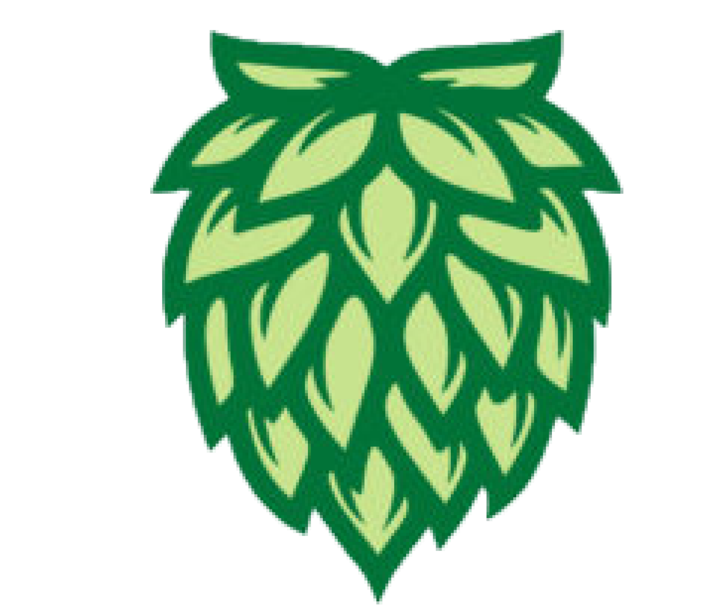

<!-- header -->

    

    <!-- Header -->
        
        <h2>GeoHops</h2>
        
<i>Hops On Point!</i>

    

    

    <!-- Shields -->
        
        
        
        
        
    

    

    <!-- Links -->
        <a href="https://github.com/armckinney/geohops/issues/new/choose">Report Bug</a>
        ·
        <a href="https://github.com/armckinney/geohops/issues/new/choose">Request Feature</a>
    

 
 

GeoHops is a web dashboard that displays various views of the Beer Permits in the Nashville Metro area.

The dashboard directly pings the data.nashville.gov API, ensuring that you are viewing the most up-to-date information.

Many different conslusions can be drawn from this data, but feel free to dig deep into whatever you like. Below are some examples of what you might like to use this tool for.

Here's why GeoHops is important:
* Determining the next best spot to place your serving business
* Identifying geographical gaps in the industry
* Tracking Nashville vs Bar permits over time
* Determining breakdown of permit types
